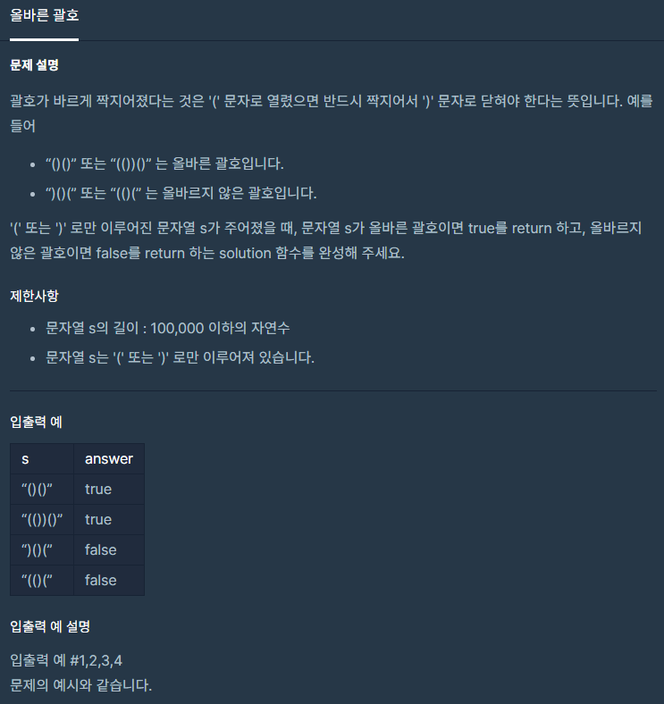

# 기초 알고리즘 해결하기

<br>

## 🔮 들어가기 앞서
1. 입력 예제를 많이 작성해서 여러 케이스를 확인하는 습관을 기릅니다.

<br>

## ▶️ 별 찍기
첫째 줄에는 별 1개, 둘째 줄에는 별 2개, N번째 줄에는 별 N개를 찍는 문제입니다.

하지만, 오른쪽을 기준으로 정렬한 별(예제 참고)을 출력해야 합니다.

### 📝 입력 예제
```
5
```

<br>

### 📌 출력 예제
```
    *
   **
  ***
 ****
*****
```

<br>

## ▶️ 1446년 10월 9일은 무슨 요일?
오늘은 2021년 10월 16일입니다. 그럼 1446년 10월 9일은 무슨 요일일까요?

### 📝 입력 예제
```
20211016
```

### 📌 출력 예제
```
토요일
```

<br>

## ▶️ 올바른 괄호
> [링크](https://programmers.co.kr/learn/courses/30/lessons/12909)

<br>

<div align="center">

  

</div>

<br>

### 📝 입력 예제
```
()()
```
```
(())()
```
```
)()(
```
```
(()(
```

<br>

### 📌 출력 예제
```
true
```
```
true
```
```
false
```
```
false
```

<br>